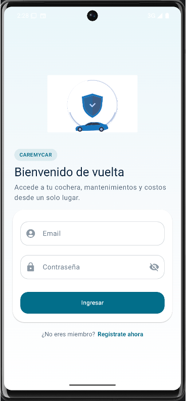
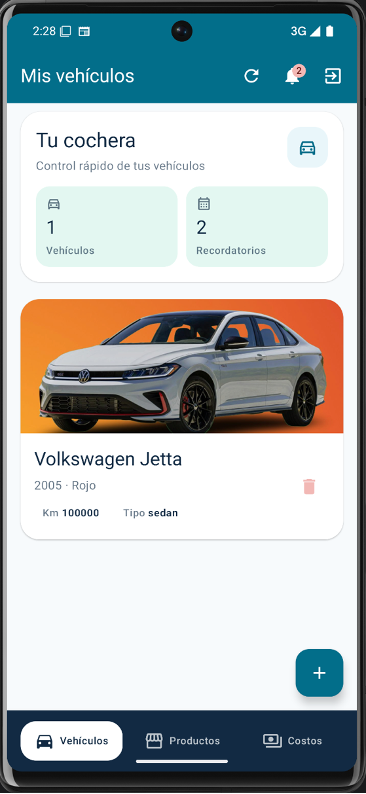
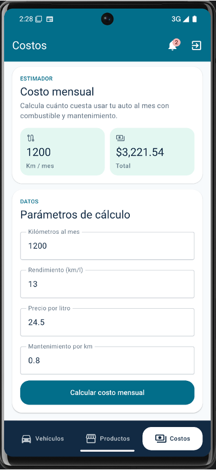
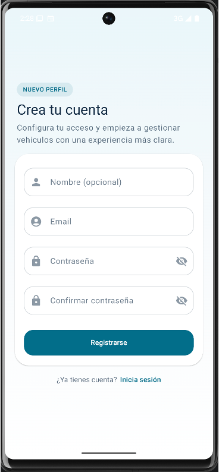
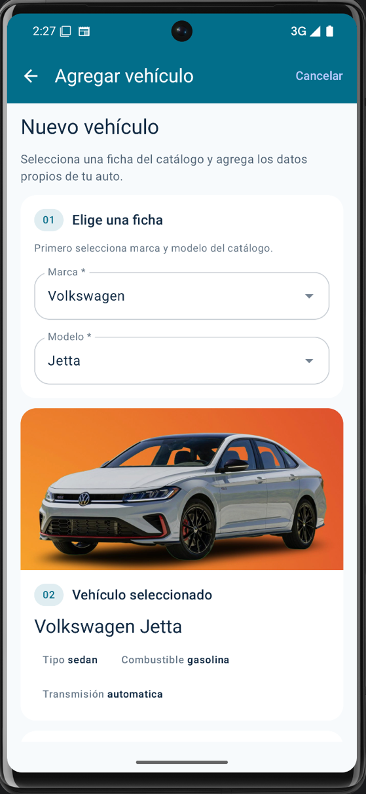
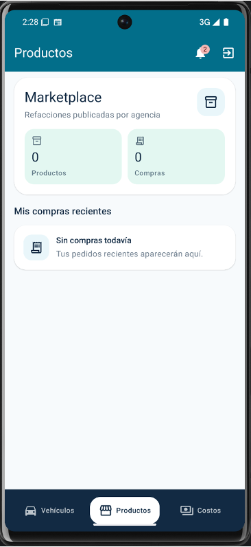

# CareMyCar

CareMyCar is a native Android application designed to help drivers manage their vehicle lifecycle from one place: vehicle registration, maintenance recommendations, service orders, marketplace purchases, and monthly cost estimation. The project is built as a portfolio-ready mobile client with a deployed REST API integration, a modern Compose UI, and a clean MVVM-oriented structure.

<p align="center">
  
  
  
</p>

## Why This Project Stands Out

- End-to-end Android client connected to a deployed backend API.
- Role-oriented experience for customer and agency workflows.
- Vehicle catalog flow with brand/model selection and generated vehicle profiles.
- Maintenance module with automatic recommendations, service quotes, and service order tracking.
- Marketplace flow for spare parts purchases with quantity controls and recent purchases.
- Monthly cost estimator based on numeric parameters such as mileage, fuel efficiency, fuel price, and maintenance cost per kilometer.
- Secure session handling using encrypted local storage.
- Modern Android stack: Kotlin, Jetpack Compose, Material 3, Hilt, Retrofit, OkHttp, Coroutines, and MVVM patterns.

## Modern UI Preview

### Authentication

The authentication experience uses a clean, minimal layout with strong visual hierarchy, rounded input fields, password visibility controls, and clear navigation between login and registration.

<p align="center">
  
  
</p>

### Vehicle Garage

Customers can register, view, update, and delete vehicles. Each vehicle is created from the catalog and includes brand, model, type, fuel, transmission, color, year, and current mileage.

<p align="center">
  
  
</p>

### Customer Modules

The bottom navigation exposes the main customer flows: vehicles, marketplace products, and cost estimation. These screens are structured around summary cards, clear empty states, and focused actions.

<p align="center">
  
  
</p>

## Core Features

- **Authentication:** user login, registration, protected session storage, and logout.
- **Vehicle management:** create, list, update mileage, and delete customer vehicles.
- **Catalog selection:** add vehicles from agency-managed brand and model records.
- **Maintenance recommendations:** generate suggested services based on vehicle data and mileage.
- **Service orders:** request services, review estimated costs, and track confirmation codes.
- **Marketplace:** browse published parts, choose quantities, estimate totals, and register purchases.
- **Cost estimator:** calculate monthly vehicle usage costs from numeric inputs.
- **Notifications:** surface maintenance alerts and customer reminders.

## Tech Stack

- **Language:** Kotlin
- **UI:** Jetpack Compose, Material 3
- **Architecture:** MVVM, repository pattern, state-driven UI
- **Networking:** Retrofit, OkHttp, REST API integration
- **Async:** Kotlin Coroutines
- **Dependency Injection:** Hilt
- **Local Security:** EncryptedSharedPreferences
- **Media:** Glide and Lottie
- **Build System:** Gradle with Android Gradle Plugin

## Architecture Overview

CareMyCar follows a Compose-first MVVM approach where UI, state, data access, and networking are separated by responsibility.

- `screens/` contains the Compose screens and user flows.
- ViewModels expose UI state and coordinate screen actions.
- Repositories isolate API access and data operations.
- `api/ApiService.kt` defines the REST contracts consumed by the app.
- Dependency modules configure Retrofit, OkHttp, authentication, and app-level services.

## API Integration

The Android client connects to the deployed CareMyCar backend:

```text
https://caremycarapi-node.onrender.com/
```

The app consumes endpoints for:

- Authentication and user sessions.
- Vehicle catalog and customer vehicles.
- Maintenance insights and recommendations.
- Service orders, quotes, and confirmation codes.
- Marketplace products and customer purchases.
- Cost estimation using numeric vehicle usage parameters.

## Getting Started

### Requirements

- Android Studio
- JDK 17
- Android SDK with the configured compile SDK
- Internet connection for backend API access

### Run The App

```bash
./gradlew :app:assembleDebug
```

Then install the generated APK on an emulator or Android device, or run the `app` configuration directly from Android Studio.

### Run Tests

```bash
./gradlew test
```

### Build Release APK

```bash
./gradlew :app:assembleRelease
```

## Project Scope

This project demonstrates practical Android engineering skills across UI polish, API integration, state management, authentication, and user-centered flows. It is suitable for showcasing in a CV or portfolio because it includes both product-level features and implementation details expected in a real mobile client.

## Documentation

Additional UML/use-case documentation is available in:

- `docs/use-case-diagram.md`
- `docs/use-case-client.mmd`
- `docs/use-case-agency.mmd`
- `docs/use-case-diagram.puml`

## License

This repository does not include a public license. All rights reserved unless a license is added.
