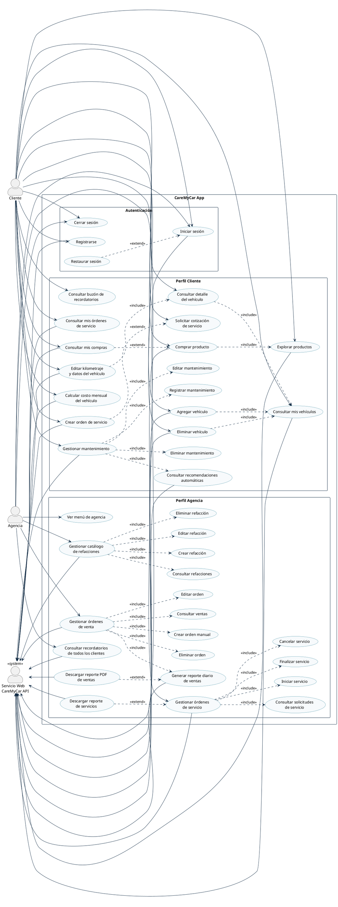

# CareMyCar - UML Use Case Diagram

Source diagram: `docs/use-case-diagram.puml`

```plantuml
@startuml CareMyCarUseCases
left to right direction
skinparam packageStyle rectangle
skinparam shadowing false
skinparam actorStyle awesome
skinparam usecase {
  BackgroundColor #F7FAFC
  BorderColor #0B6E8A
  ArrowColor #102A43
}
skinparam rectangle {
  BorderColor #102A43
  BackgroundColor #FFFFFF
}

actor "Cliente" as Client
actor "Agencia" as Agency
actor "Servicio Web\nCareMyCar API" as Api <<system>>

rectangle "CareMyCar App" {
  package "Autenticación" {
    usecase "Registrarse" as UC_Register
    usecase "Iniciar sesión" as UC_Login
    usecase "Cerrar sesión" as UC_Logout
    usecase "Restaurar sesión" as UC_RestoreSession
  }

  package "Perfil Cliente" {
    usecase "Consultar mis vehículos" as UC_ListVehicles
    usecase "Agregar vehículo" as UC_AddVehicle
    usecase "Consultar detalle\ndel vehículo" as UC_ViewVehicle
    usecase "Editar kilometraje\ny datos del vehículo" as UC_EditVehicle
    usecase "Eliminar vehículo" as UC_DeleteVehicle
    usecase "Consultar buzón de\nrecordatorios" as UC_ClientReminders
    usecase "Gestionar mantenimiento" as UC_ManageMaintenance
    usecase "Registrar mantenimiento" as UC_CreateMaintenance
    usecase "Editar mantenimiento" as UC_EditMaintenance
    usecase "Eliminar mantenimiento" as UC_DeleteMaintenance
    usecase "Consultar recomendaciones\nautomáticas" as UC_Recommendations
    usecase "Solicitar cotización\nde servicio" as UC_QuoteService
    usecase "Crear orden de servicio" as UC_CreateServiceOrder
    usecase "Consultar mis órdenes\nde servicio" as UC_ClientServiceOrders
    usecase "Explorar productos" as UC_BrowseProducts
    usecase "Comprar producto" as UC_BuyProduct
    usecase "Consultar mis compras" as UC_MyPurchases
    usecase "Calcular costo mensual\ndel vehículo" as UC_MonthlyCost
  }

  package "Perfil Agencia" {
    usecase "Ver menú de agencia" as UC_AgencyHome
    usecase "Gestionar catálogo\nde refacciones" as UC_ManageParts
    usecase "Crear refacción" as UC_CreatePart
    usecase "Editar refacción" as UC_EditPart
    usecase "Eliminar refacción" as UC_DeletePart
    usecase "Consultar refacciones" as UC_ListParts
    usecase "Gestionar órdenes\nde venta" as UC_ManageSales
    usecase "Crear orden manual" as UC_CreateOrder
    usecase "Consultar ventas" as UC_ListOrders
    usecase "Editar orden" as UC_EditOrder
    usecase "Eliminar orden" as UC_DeleteOrder
    usecase "Generar reporte diario\nde ventas" as UC_SalesReport
    usecase "Descargar reporte PDF\nde ventas" as UC_SalesPdf
    usecase "Consultar recordatorios\nde todos los clientes" as UC_AllReminders
    usecase "Gestionar órdenes\nde servicio" as UC_ManageServiceOrders
    usecase "Consultar solicitudes\nde servicio" as UC_ListServiceOrders
    usecase "Iniciar servicio" as UC_StartService
    usecase "Finalizar servicio" as UC_CompleteService
    usecase "Cancelar servicio" as UC_CancelService
    usecase "Descargar reporte\nde servicios" as UC_ServiceReport
  }
}

Client --> UC_Register
Client --> UC_Login
Client --> UC_Logout
Client --> UC_ListVehicles
Client --> UC_AddVehicle
Client --> UC_ViewVehicle
Client --> UC_EditVehicle
Client --> UC_DeleteVehicle
Client --> UC_ClientReminders
Client --> UC_ManageMaintenance
Client --> UC_QuoteService
Client --> UC_CreateServiceOrder
Client --> UC_ClientServiceOrders
Client --> UC_BrowseProducts
Client --> UC_BuyProduct
Client --> UC_MyPurchases
Client --> UC_MonthlyCost

Agency --> UC_Login
Agency --> UC_Logout
Agency --> UC_AgencyHome
Agency --> UC_ManageParts
Agency --> UC_ManageSales
Agency --> UC_AllReminders
Agency --> UC_ManageServiceOrders

UC_RestoreSession ..> UC_Login : <<extend>>
UC_AddVehicle ..> UC_ListVehicles : <<include>>
UC_ViewVehicle ..> UC_ListVehicles : <<include>>
UC_EditVehicle ..> UC_ViewVehicle : <<include>>
UC_DeleteVehicle ..> UC_ListVehicles : <<include>>
UC_ManageMaintenance ..> UC_CreateMaintenance : <<include>>
UC_ManageMaintenance ..> UC_EditMaintenance : <<include>>
UC_ManageMaintenance ..> UC_DeleteMaintenance : <<include>>
UC_ManageMaintenance ..> UC_Recommendations : <<include>>
UC_CreateServiceOrder ..> UC_QuoteService : <<extend>>
UC_BuyProduct ..> UC_BrowseProducts : <<include>>
UC_MyPurchases ..> UC_BuyProduct : <<extend>>
UC_ManageParts ..> UC_ListParts : <<include>>
UC_ManageParts ..> UC_CreatePart : <<include>>
UC_ManageParts ..> UC_EditPart : <<include>>
UC_ManageParts ..> UC_DeletePart : <<include>>
UC_ManageSales ..> UC_ListOrders : <<include>>
UC_ManageSales ..> UC_CreateOrder : <<include>>
UC_ManageSales ..> UC_EditOrder : <<include>>
UC_ManageSales ..> UC_DeleteOrder : <<include>>
UC_ManageSales ..> UC_SalesReport : <<include>>
UC_SalesPdf ..> UC_SalesReport : <<extend>>
UC_ManageServiceOrders ..> UC_ListServiceOrders : <<include>>
UC_ManageServiceOrders ..> UC_StartService : <<include>>
UC_ManageServiceOrders ..> UC_CompleteService : <<include>>
UC_ManageServiceOrders ..> UC_CancelService : <<include>>
UC_ServiceReport ..> UC_ManageServiceOrders : <<extend>>

Api <-- UC_Login
Api <-- UC_Register
Api <-- UC_ListVehicles
Api <-- UC_AddVehicle
Api <-- UC_EditVehicle
Api <-- UC_DeleteVehicle
Api <-- UC_ManageMaintenance
Api <-- UC_Recommendations
Api <-- UC_CreateServiceOrder
Api <-- UC_ClientServiceOrders
Api <-- UC_BrowseProducts
Api <-- UC_BuyProduct
Api <-- UC_MyPurchases
Api <-- UC_MonthlyCost
Api <-- UC_ManageParts
Api <-- UC_ManageSales
Api <-- UC_AllReminders
Api <-- UC_ManageServiceOrders
Api <-- UC_SalesReport
Api <-- UC_SalesPdf
Api <-- UC_ServiceReport

@enduml
```
